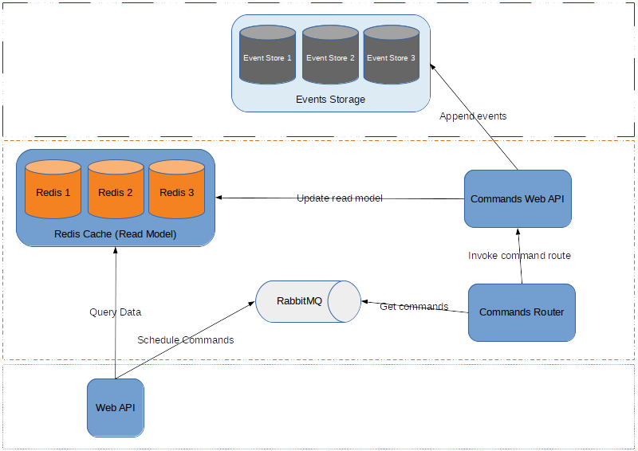

# Event Sourced Counter

Trying out [Event Sourcing] design

## Design



## Run

```sh
# run an instance of Event Store database
docker run -it --name eventstore --publish 2113:2113 --publish 1113:1113 eventstore/eventstore

# redis
docker run --name esc-redis --publish 6379:6379 --detach redis

# run the web API
cd ./EventSourcedCounter/
dotnet run
```

```sh
# start a new counter "foo"
curl -X POST --data '' "http://localhost:5000/api/counters/foo"

# get value for counter "foo"
curl -X GET "http://localhost:5000/api/counters/foo"

# increment it by 1 and then by 3
curl -X PATCH "http://localhost:5000/api/counters/foo"
curl -X PATCH "http://localhost:5000/api/counters/foo?count=3"

# get value for counter "foo" again
curl -X GET "http://localhost:5000/api/counters/foo"
```

```sh
# connect to Redis instance
docker run -it --link esc-redis:redis --rm redis redis-cli -h redis -p 6379
```

## ToDo

- [X] Event Store
- [X] CQRS
- [X] Read Model
- [ ] Snapshots
- [ ] RabbitMQ for mutations
- [ ] Rx.JS and Event Handlers
- [ ] Clusters for EventStore, Redis, and RabbitMQ
- [X] System Design Diagram
- [ ] What's Next?

[Event Sourcing]: https://www.erikheemskerk.nl/event-sourcing-awesome-powerful-different/
