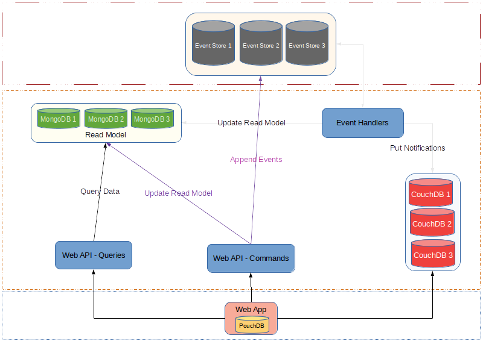

# Event Sourced Counter

Trying out [Event Sourcing] design

## Design



## Run

```sh
# run an instance of Event Store in the background
docker run --detach --name esc-eventstore --publish 2113:2113 --publish 1113:1113 eventstore/eventstore

# run an instance of Mongo in the background
docker run --detach --name esc-mongo --publish 27017:27017 mongo

# docker rm -fv esc-eventstore esc-mongo
```

```sh
# run the web API
cd ./EventSourcedCounter/
dotnet run
```

```sh
# start a new counter "foo"
curl -X POST --data '' "http://localhost:5000/api/counters/foo"

# get value for counter "foo"
curl -X GET "http://localhost:5000/api/counters/foo"

# increment it by 1 and then by 3
curl -X PATCH "http://localhost:5000/api/counters/foo"
curl -X PATCH "http://localhost:5000/api/counters/foo?count=3"

# get value for counter "foo" again
curl -X GET "http://localhost:5000/api/counters/foo"
```

```sh
# run services
docker start esc-eventstore esc-mongo
```

```sh
# create 100 counters
for i in {1..100}
do
    curl -X POST --data '' "http://localhost:5000/api/counters/foo$i"
done
```

## Roadmap

- [X] [Event Store]
- [X] Read Model: [Redis]
- [ ] Read Model: [Postgres]
- [X] Read Model: [Mongo]
- [ ] Read Model: [Neo4j]
- [ ] Events Replay Tests
- [ ] Event Store Snapshots
- [ ] [CQRS] Pattern
- [ ] [DDD] Patterns
- [X] Counter Service
- [X] [ULID]
- [ ] [Identicon] Service
- [ ] [OpenAPI] Specs Generator
- [ ] [Swagger UI]
- [ ] [DocFX] Docs Generator
- [ ] Code Coverage Report
- [ ] Code Quality Report
- [ ] [Angular] SPA
- [ ] [Angular Material]
- [ ] [Docker]ized Services
- [ ] [Travis-CI] multi-staged builds
- [ ] Event Store cluster with 3 nodes
- [ ] [Heroku] Deployments
- [ ] Performance Tests
- [ ] [Cucumber] Definitions
- [ ] System Design Diagrams
- [ ] Try [PouchDB] in the SPA
- [ ] Try [Push Notifications] in the SPA
- [ ] Try [Web Socket] in the SPA
- [ ] Try [ReactiveX] for Event Handlers
- [ ] Try [Blazor]

[Event Sourcing]: https://www.erikheemskerk.nl/event-sourcing-awesome-powerful-different/
[Event Store]: https://eventstore.org/
[Redis]: https://redis.io/
[Postgres]: https://www.postgresql.org/
[Mongo]: https://www.mongodb.com/
[Neo4j]: https://neo4j.com/
[CQRS]: https://www.martinfowler.com/bliki/CQRS.html
[DDD]: https://airbrake.io/blog/software-design/domain-driven-design
[ULID]: https://github.com/ulid/spec
[Identicon]: https://jdenticon.com/
[OpenAPI]: https://swagger.io/
[Swagger UI]: https://swagger.io/tools/swagger-ui/
[DocFX]: https://dotnet.github.io/docfx/
[Angular]: https://angular.io/
[Angular Material]: https://material.angular.io/
[Docker]: https://www.docker.com/
[Travis-CI]: https://travis-ci.org/
[Heroku]: https://www.heroku.com/
[Cucumber]: http://docs.cucumber.io/
[PouchDB]: https://github.com/pouchdb/pouchdb
[Push Notifications]: https://developers.google.com/drive/api/v3/push
[Web Socket]: https://developer.mozilla.org/en-US/docs/Web/API/WebSockets_API
[ReactiveX]: http://reactivex.io/
[Blazor]: https://blazor.net
